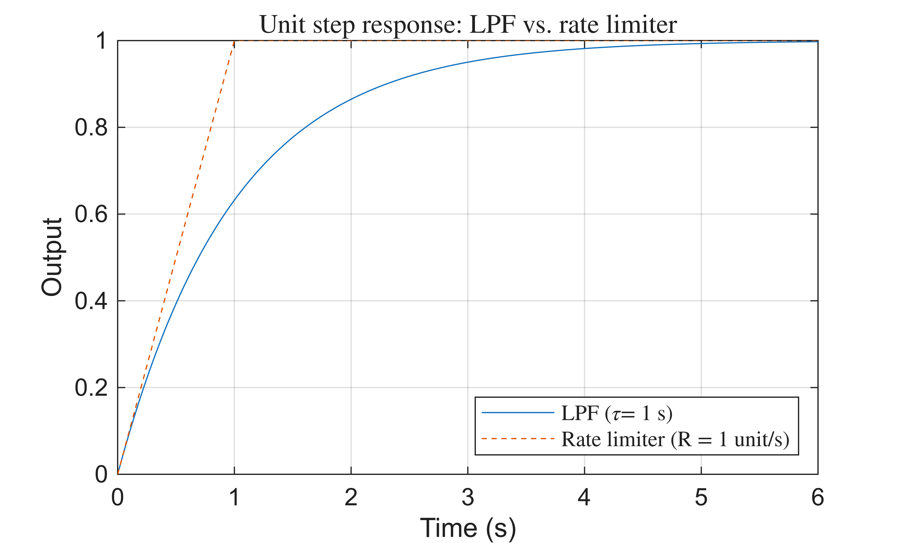
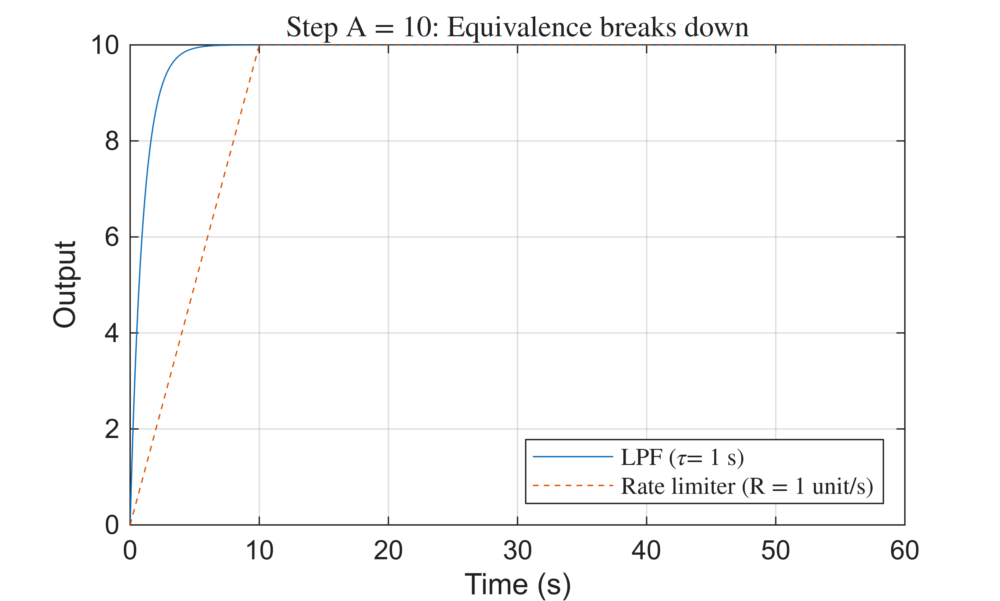
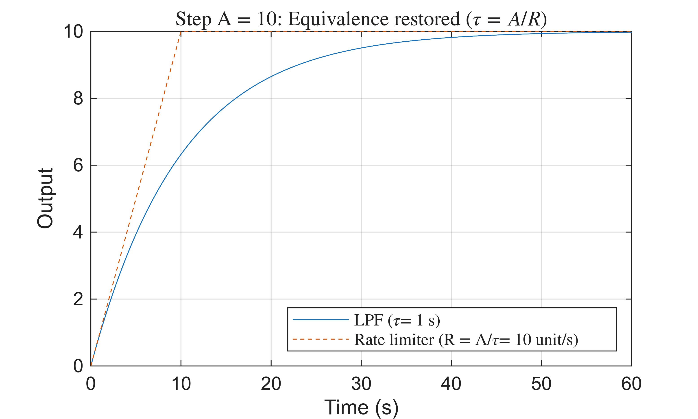
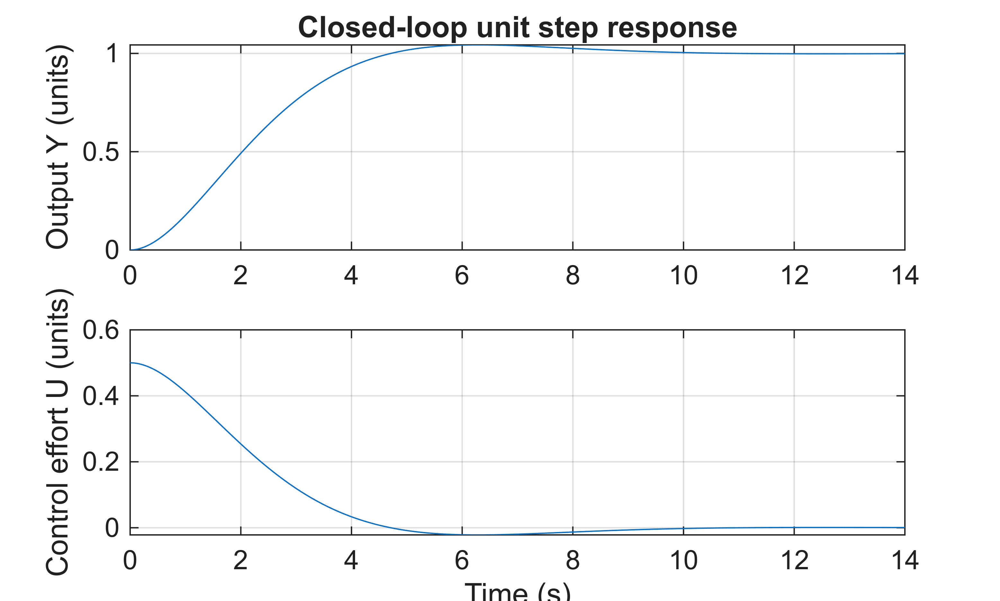
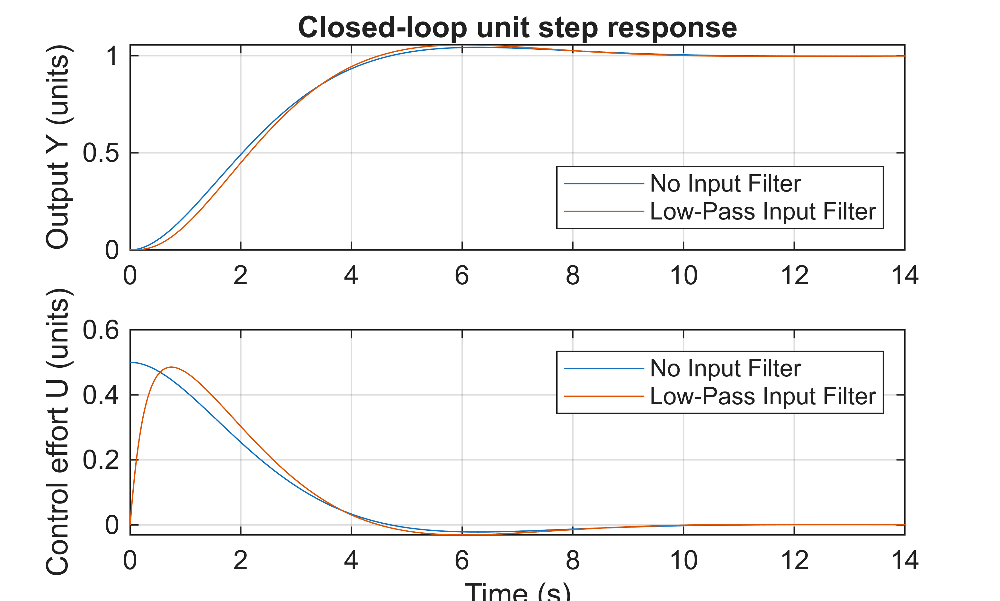
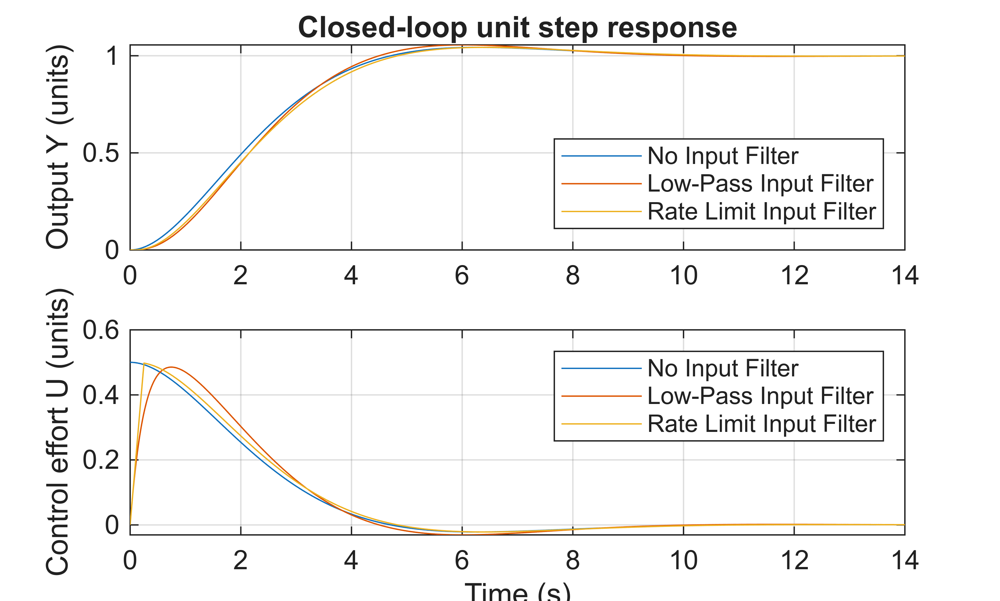

# Input Filtering: The effects of smoothing the command on feedback control

This script demonstrates both linear (first\-order low\-pass filter) and non\-linear (rate limiter) command filtering.


The purpose of a filter between the command and the controller is to prevent aggressive inputs sent to the plant.  If designed correctly, the filter does not adversely affect the performance of the closed\-loop system, but it does reduce rapid fluctuations in the control to the plant.   In the context of the USV case study, smoothing the commands avoids rapid fluctuations in the throttle and rudder commands, these fluctuations are faster than the system can respond and can stress the physical plant.  


The input filter does this by delaying the "arrival" of the command to the feedback loop.   


For the design purposes we'd like to have a linear model of an input filter where we can both simulate the expected response and use analytical tools to assess the feedback performance. The one parameter of this filter is the time constant ( $\tau$ ).   A recipe for setting this parameter value benefits from understanding a bit of control theory (concepts of transfer functions, time/frequency response, etc.) which can be a bit abstract.  For this and other reasons a common input filter implementation is a rate limiter (or rate limit filter).  For the case of motion control via velocity feedback, the rate limit parameter ( $R$ ) applied to the velocity command can be thought of as the maximum acceleration \- either the physical limits or design maximum. 


We can also equate the two models by setting $R=A/\tau$ $\iff$ $\tau =A/R$, where $A$ is the amplitude of the step input.

# Time response of input filters
## Linear low\-pass filter

A low\-pass filter (LPF) can be modeled as a first\-order transfer function with a DC gain of $K_{DC} =1$ and is fully specified by its time constant $\tau$. 

 $$ G_{\mathrm{if}} (s)=\frac{1}{\tau s+1} $$ 

 We can generate the unit step response from the transfer function

```matlab
tau = 1;        % LPF time constant (s)

dt = 0.01;
t = (0 : dt : 6)';

sys_lpf = tf(1, [tau 1]);
r_lpf   = step(sys_lpf, t);
```
## Rate limiter

A rate limiter is specified by its maximum rate $R$ units/s.  Setting $R=1/\tau$ ensures the rate limit equals the maximum slope of the LPF step response.  Here $\tau =1$ s and $R=1$ unit/s.  For a step input the output rises at rate R until reaching 1.0.

```matlab
R   = 1/tau;    % rate limit (units/s)

r_rl = min(R * t, 1);
```

Compare the time response

```matlab
figure(); clf;
plot(t, r_lpf, t, r_rl, '--');
legend('LPF (\tau = 1 s)', 'Rate limiter (R = 1 unit/s)', ...
    'Interpreter', 'latex', 'Location', 'southeast');
xlabel('Time (s)');
ylabel('Output');
title('Unit step response: LPF vs. rate limiter', 'Interpreter', 'latex');
grid on;
```



Notice that the slope of each response is the same at time zero.

# Amplitude dependency

When the step amplitude increases to $A=10$ units with the same $R=1$ units/s, the equivalence breaks down.  The LPF scales linearly with $A$ (same shape, larger amplitude), but the rate limiter takes $A$ times longer to reach the setpoint.

```matlab
A = 10;
t2 = (0 : dt : 60)';

r_lpf2 = A * step(sys_lpf, t2);
r_rl2  = min(R * t2, A);

clf();
plot(t2, r_lpf2, t2, r_rl2, '--');
legend('LPF (\tau = 1 s)', 'Rate limiter (R = 1 unit/s)', ...
    'Interpreter', 'latex', 'Location', 'southeast');
xlabel('Time (s)');
ylabel('Output');
title('Step A = 10: Equivalence breaks down', 'Interpreter', 'latex');
grid on;
```



Notice the slope of the LPF is much larger than that of the rate limiter ( $R$ ).

# Rate limit and time constant equivalency

The general equivalence condition is $R=A/\tau$ $\iff$ $\tau =A/R$.  To restore the match for $A=10$, we adjust the LPF to $\tau_2 =A/R=10$ s.

```matlab
tau2 = A/R;
sys_lpf2 = tf(1, [tau2 1]);
r_lpf3 = A * step(sys_lpf2, t2);

clf();
plot(t2, r_lpf3, t2, r_rl2, '--');
legend('LPF (\tau = 1 s)', 'Rate limiter (R = A/\tau = 10 unit/s)', ...
    'Interpreter', 'latex', 'Location', 'southeast');
xlabel('Time (s)');
ylabel('Output');
title('Step A = 10: Equivalence restored ($\tau = A/R$)', 'Interpreter', 'latex');
grid on;
```


# Effect of input filtering on closed\-loop performance

Consider the plant $G_{ol} (s)=\frac{1}{s(s+1)}$, representative of a yaw or heading model for a mobile robot.  

```matlab
Gol = tf(1,[1 1 0]);
```

For illustrative purposes we'll consider a proportional controller tuned to achieve the fastest response with $\zeta \ge 0.707$.


We'll consider three cases and look at the command tracking performance and the required control effort: 

1.  no input filter
2. linear LP filter
3. non\-linear rate limiter
## No input filter

Here we can solve for the proportional gain analytically (Write out the block diagram and show that we can solve this analytically.)

```matlab
% Design goal: fastest response with zeta >= 0.707
zeta = 0.707;
% Proportional feedback gain
Kp = (1/(2*zeta))^2;
% Closed loop transfer funtion
Gcl1 = (Kp*Gol)/(1+Kp*Gol);

% CL response
tt = (0:dt:14)';
yy1 = step(Gcl1,tt);
```

Another aspect of the design that we should consider is the *control effort* (U in the block diagram) which is the input being sent to the plant.  From the block diagram we can find the *control effort sensitivity function* which is an expression for command input and control effort output, $\frac{U(s)}{C(s)}$.

```matlab
Gu1 = Kp/(1+Kp*Gol);
% Step response for the control effort sensitivity function.
uu1 = step(Gu1,tt);

clf();
subplot(211)
plot(tt,yy1, "DisplayName","No Input Filter")
grid on
hold on;
ylabel("Output Y (units)")
title("Closed-loop unit step response")
subplot(212)
plot(tt,uu1, "DisplayName","No Input Filter")
hold on;
grid on
xlabel('Time (s)')
ylabel("Control effort U (units)")
```



Notice that the control effort instantaneously jumps up at time zero.   Real actuators are never perfect, so they can't respond instantaneously, there are always unmodeled dynamics that can be excited by these rapid fluctuations and it can stress the physical system.

## Low\-pass input filter

If we want to smooth this rapidly fluctuating input with a low\-pass filter, we need to choose a time constant.  The performance is not sensitive to this value, but if it is too large, the command will take too long to arrive and it will slow down the response and if it is too small the rapid fluctuations will be passed along to the feedback loop.


A reasonable starting point is $\tau$ of less than 1/4 the fastest dynamics in the plant.  For this plant, this value is a good first test:

```matlab
tau = 0.25;
Glp = tf(1,[tau 1]);
```

Then the closed\-loop responses:

```matlab
Gcl2 = Glp*feedback(Kp*1.1 * Gol, 1);
yy2 = step(Gcl2, tt);
Gu2 = Glp* (Kp2/(1+Kp2*Gol));
uu2 = step(Gu2, tt);

subplot(211)
hold on;
plot(tt, yy2, "DisplayName","Low-Pass Input Filter")
legend("Location","southeast")
subplot(212)
hold on;
plot(tt, uu2, "DisplayName","Low-Pass Input Filter")
legend("Location","northeast")
```



Notice that the response is a little slower (we could speed it up by increasing $K_p$ a small amount), but that the control effort is much smoother without the rapid jump at time zero.

## Rate limiter

We set the rate to be equivalent for a *unit* step function

```matlab
A = 1;
R = A/tau;
```

Then generate a time series for the reference input to the feedback system (R).

```matlab
r_rl = min(R * tt, 1);
```

Then generate the linear response of the closed\-loop transfer functions to this time series.

```matlab
yy3 = lsim(feedback(Kp * Gol, 1), r_rl, tt);
uu3 = lsim(Kp/(1+Kp*Gol), r_rl, tt);
```

```matlab
subplot(211)
plot(tt, yy3,"DisplayName", "Rate Limit Input Filter")
legend("Location","southeast")
subplot(212)
plot(tt,uu3,"DisplayName", "Rate Limit Input Filter")
```



Notice that the closed\-loop output for all three are very similar, but the control effort is different for each case.

# Key takeaways on input filtering

**1. Output performance is similar across all three options.**  With appropriate gain tuning the closed\-loop step response looks roughly the same.  Input filtering trades a small amount of speed for smoother behavior.


**2. The real benefit shows up in the control effort.**  Without a filter, the controller sees a full step error at $t=0$ and immediately demands maximum effort — an instantaneous jump in the plant input that is physically unrealizable and stresses actuators.


**3. The low pass filter produces a smooth command; the rate limiter has a corner.** 


The LPF output is exponential (infinitely smooth), so the control effort transitions continuously.  The rate\-limited command switches abruptly from ramp to constant at $t=A/R$, leaving a kink in the control effort.


**4. The rate limiter is nonlinear; its equivalent time constant depends on amplitude.**


Large setpoint changes take proportionally longer to settle.  The equivalence $R=A/\tau$ must be re\-evaluated whenever the command amplitude changes.


**5. Preview — frequency response.**  The LPF has a well\-defined cutoff frequency $\omega =1/\tau$ rad/s that characterizes which command frequencies reach the plant.


We will return to this once we cover frequency response and Bode plots.

