[← Back to Lab 2 overview](index.qmd)

::: {.callout-note appearance="simple"}
**Working draft.** Example step-response figures from the three experiments (Base, FeedForward, Tuned) for the speed and yaw-rate channels. Each case has two figures:

- **Timeseries** — setpoint, measured response, and actuator command across the full step window.
- **PID internals** — `Tar` / `Act` with metrics text box (top), and the per-term breakdown (`P`, `I`, `D`, `FF`) plus the actuator command (bottom).

A separate **integrator-windup** demonstration on the Base/yaw run shows what happens when the controller is allowed to hold the step long enough for the I term to wind up.
:::

## Base

ArduRover stock PID gains, FF off, rate limiters off, throttle baseline off. The reference against which **FeedForward** and **Tuned** are compared.

### Speed channel

:::: {.columns}
::: {.column width="50%"}
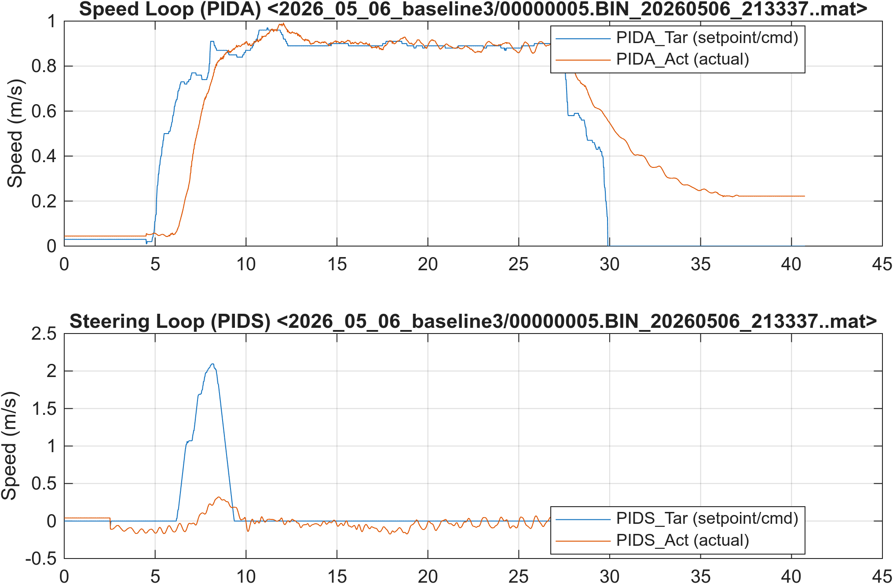
:::
::: {.column width="50%"}
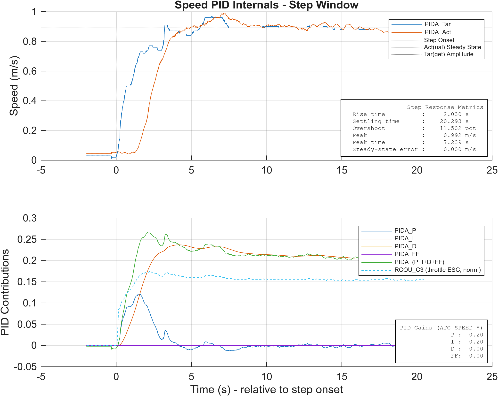
:::
::::

### Yaw-rate channel

:::: {.columns}
::: {.column width="50%"}
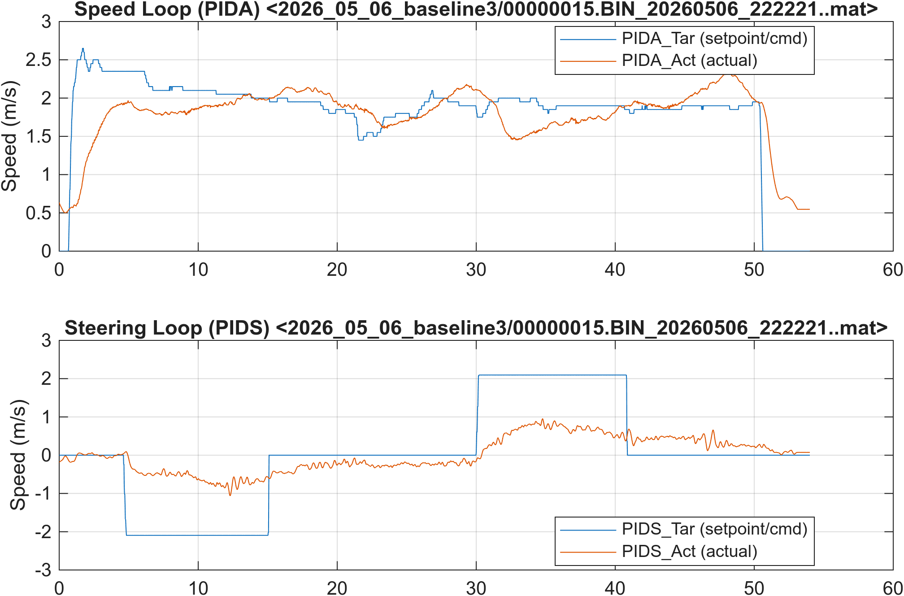
:::
::: {.column width="50%"}
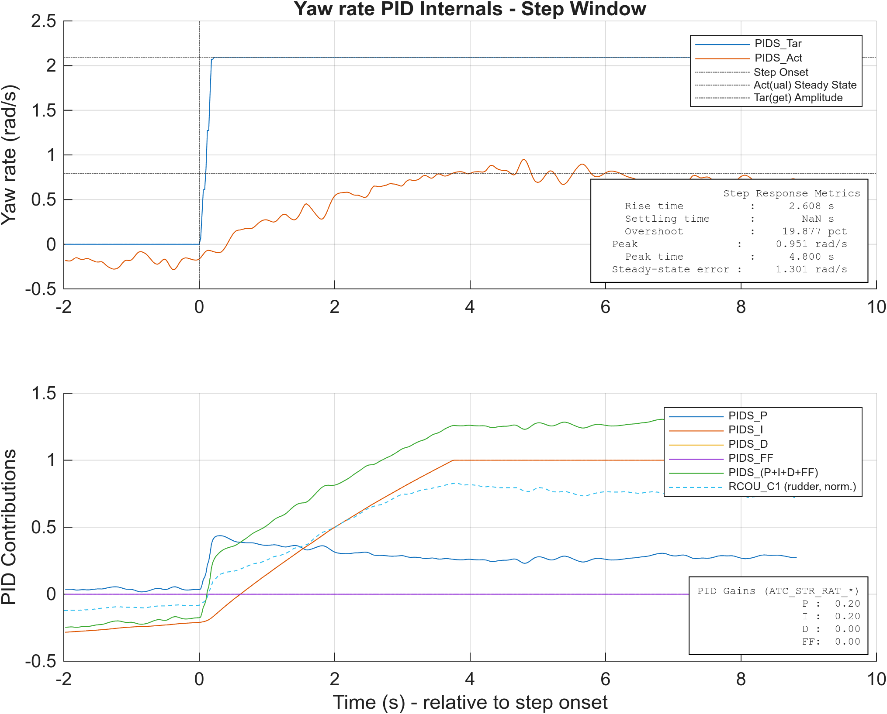
:::
::::

### Yaw-rate — integrator windup demonstration

The same Base/yaw configuration as above, but the step input is held long enough for the integrator to wind up. The delayed recovery on the step-back illustrates classic I-term windup.

:::: {.columns}
::: {.column width="50%"}

:::
::: {.column width="50%"}
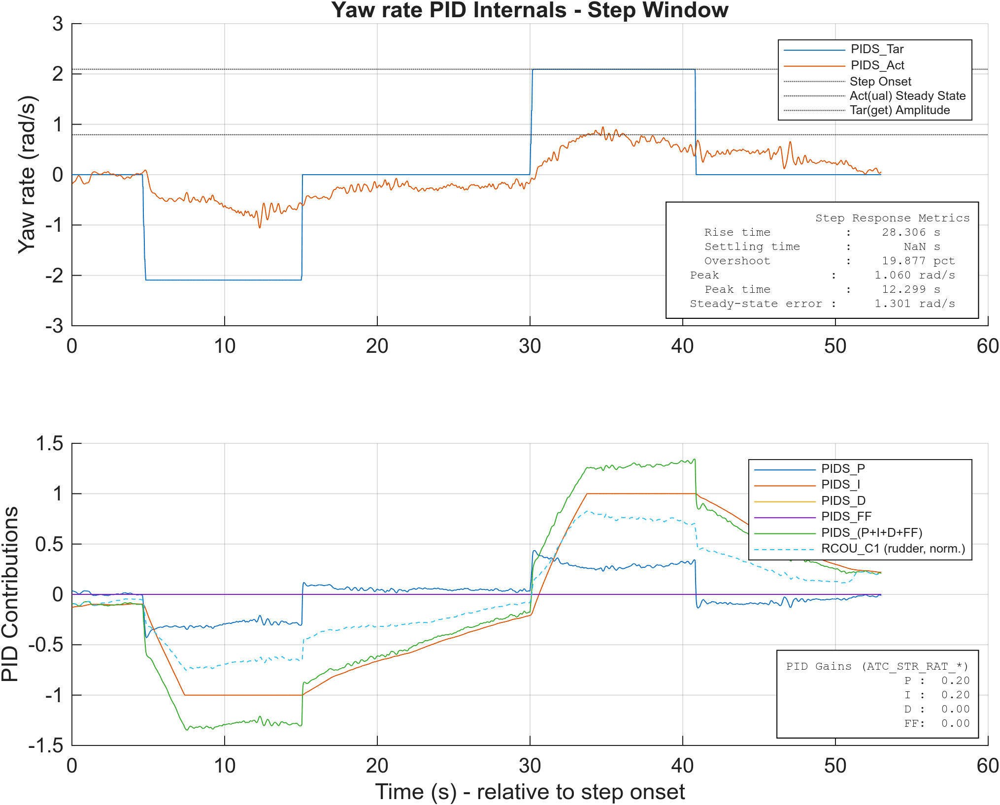
:::
::::

## FeedForward

Restored `ATC_SPEED_FF` and `ATC_STR_RAT_FF` to lab values; PID gains unchanged from **Base**.

### Speed channel

:::: {.columns}
::: {.column width="50%"}
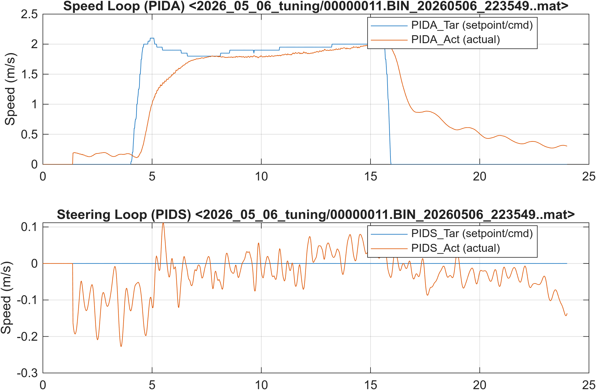
:::
::: {.column width="50%"}
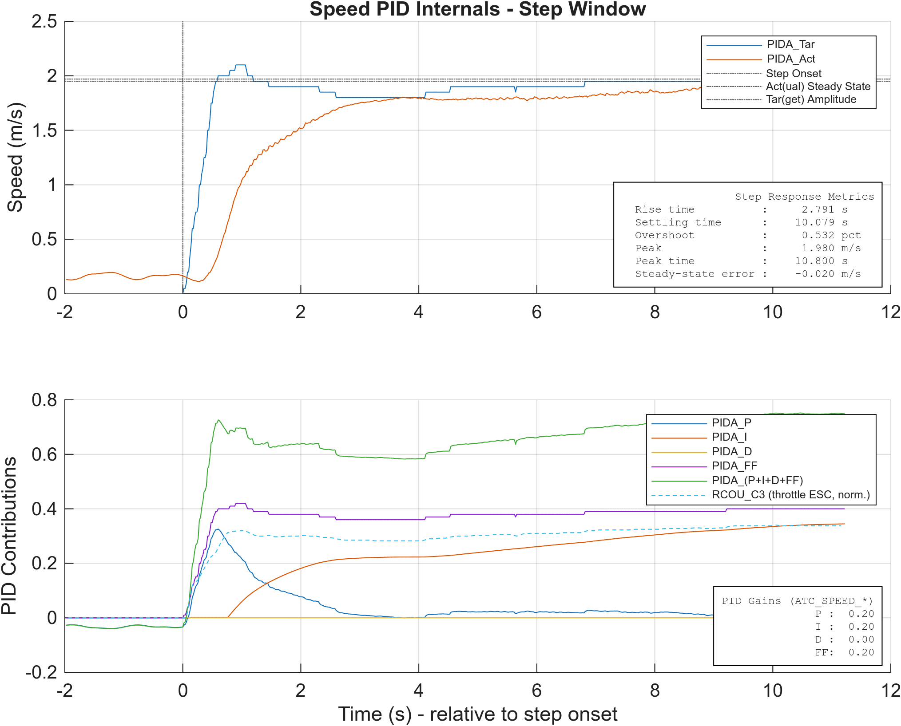
:::
::::

### Yaw-rate channel

:::: {.columns}
::: {.column width="50%"}
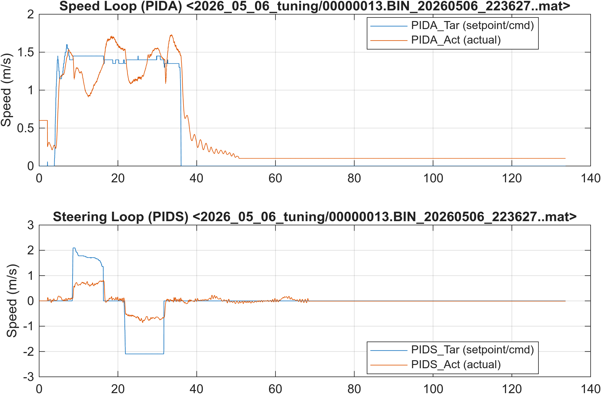
:::
::: {.column width="50%"}
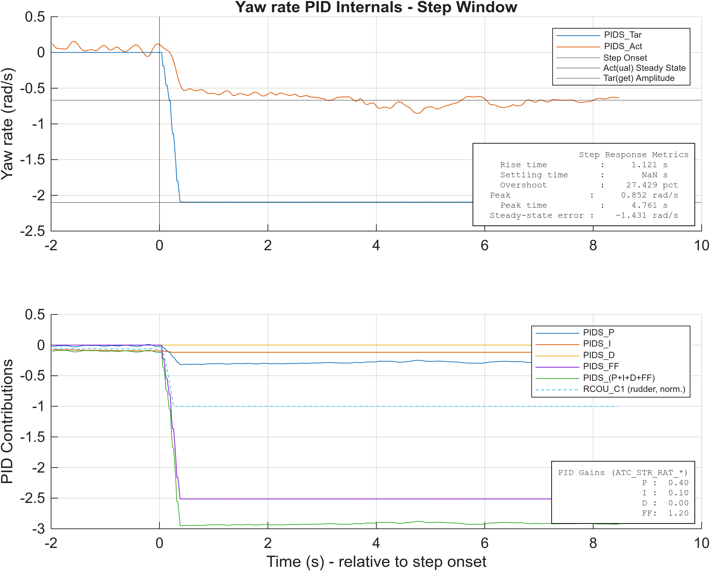
:::
::::

## Tuned

Adjusted `ATC_SPEED_P/I/D` and `ATC_STR_RAT_P/I/D` for best response; FF kept on.

### Speed channel

:::: {.columns}
::: {.column width="50%"}
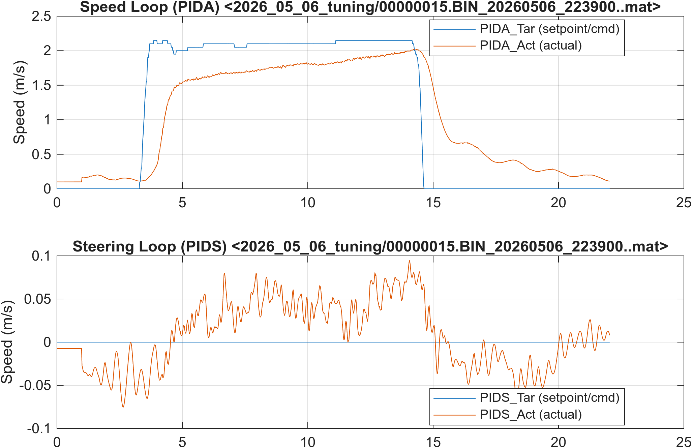
:::
::: {.column width="50%"}
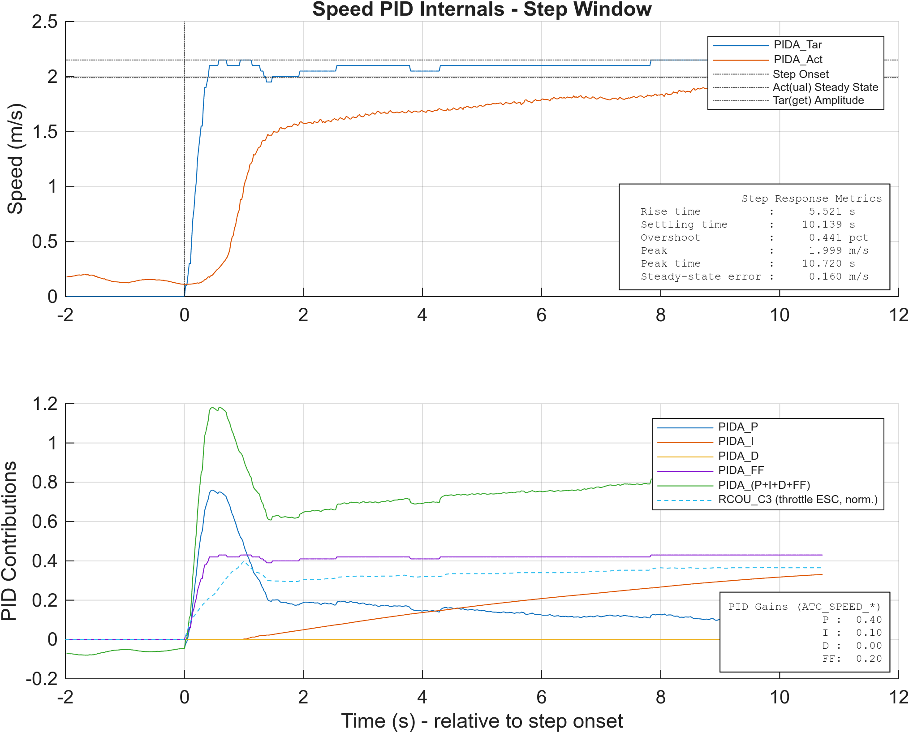
:::
::::

### Yaw-rate channel

:::: {.columns}
::: {.column width="50%"}
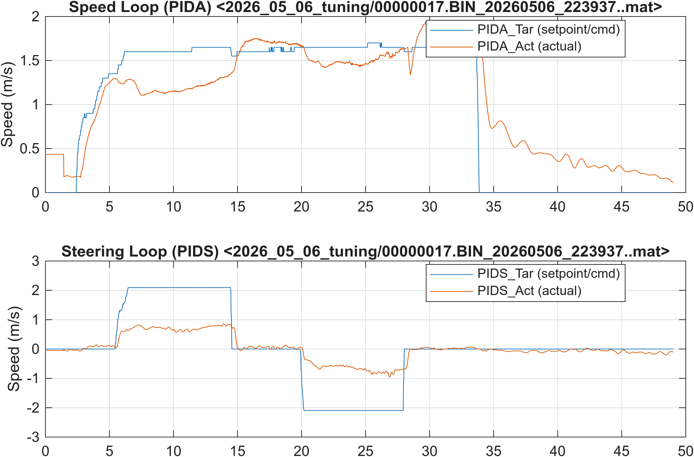
:::
::: {.column width="50%"}
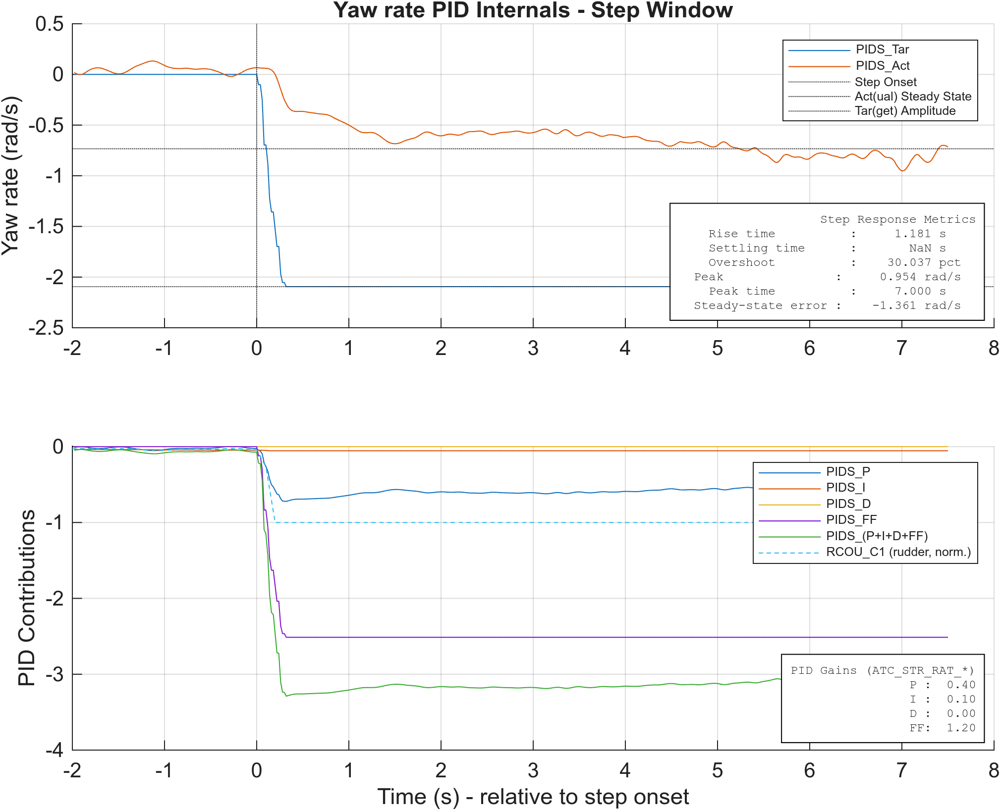
:::
::::

## Summary

_TBD — comparison table across the three experiments for both channels. Numbers come from the metrics text box in each PID-internals figure._

| Experiment | Channel | Rise time (s) | Settling (s) | Overshoot (%) | SS error |
|---|---|---:|---:|---:|---:|
| Base        | Speed | _TBD_ | _TBD_ | _TBD_ | _TBD_ |
| Base        | Yaw   | _TBD_ | _TBD_ | _TBD_ | _TBD_ |
| FeedForward | Speed | _TBD_ | _TBD_ | _TBD_ | _TBD_ |
| FeedForward | Yaw   | _TBD_ | _TBD_ | _TBD_ | _TBD_ |
| Tuned       | Speed | _TBD_ | _TBD_ | _TBD_ | _TBD_ |
| Tuned       | Yaw   | _TBD_ | _TBD_ | _TBD_ | _TBD_ |
