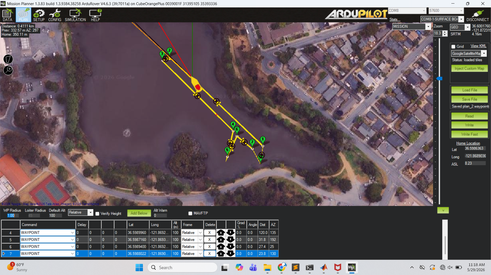
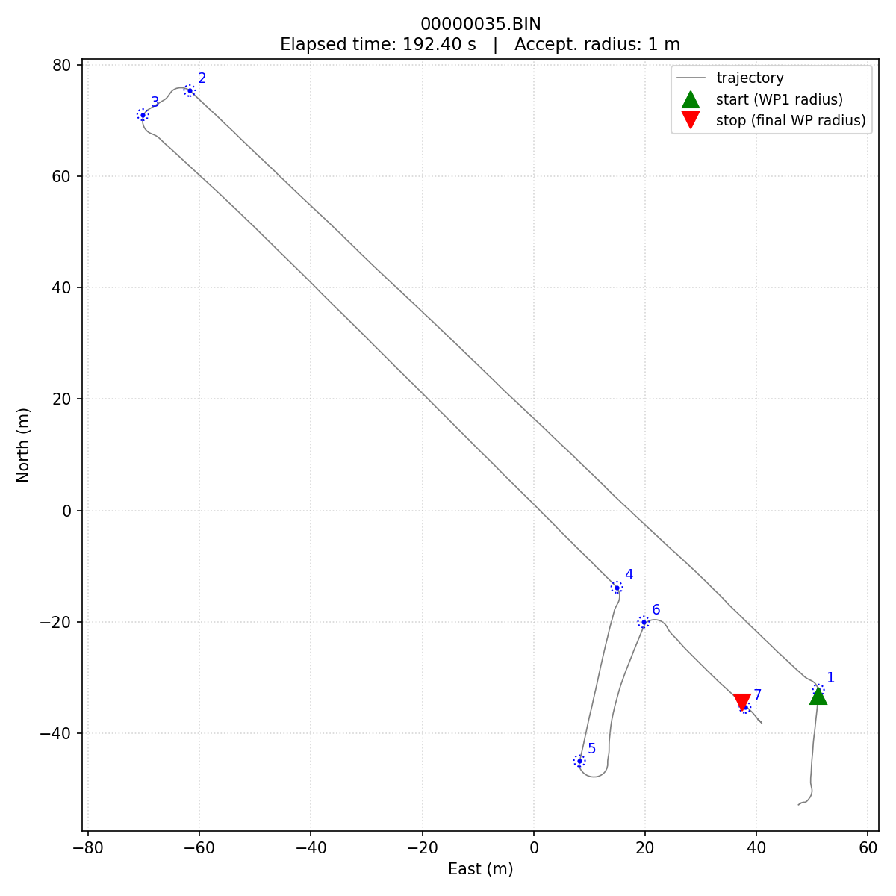

## Overview

* Use the **stabilization layer** you tuned in [Lab 2](../w07_lab_usv_pid/index.qmd) as the foundation for autonomously following a sequence of waypoints with ArduRover's guidance and navigation stack.
* More **exploratory** than Lab 1 and Lab 2: we provide the framework, the goal, and a baseline configuration; you are welcome to use all the tools at your disposal to iterate and improve on that baseline. (This is an authentic exploration of the autopilot's capabilities.  We don't know how it is going to turn out!)
* The **feedback concepts from Lab 2** (proportional error, feedforward, transient performance) reappear at the guidance layer. We will use that to motivate what's happening; a full treatment of guidance and navigation is **beyond the scope of this class**.

.](images/ardurover_arch.svg){fig-alt="ArduRover architecture block diagram, Mission Planner laptop above the USV's autopilot, mission execution / guidance / stabilization layers cascading to actuators."}

### Waypoint Mission Challenge

* **Minimize course time** for a fixed mission of 3–5 waypoints.
* **Course time** is defined as
    * **Start:** the first time the USV is within the acceptance threshold of waypoint 1.
    * **End:** the first time the USV enters the threshold of the final waypoint.
* **Two measurements per run:**
    * Stopwatch + Mission Planner display, recorded by the team in the field (primary measurement).
    * Log-derived estimate from post-processing (target — exact scoring approach TBD).

{fig-alt="Mission Planner screenshot showing the uploaded waypoint mission overlaid on a satellite map of the course area."}

{fig-alt="Prototype course run showing the USV's trajectory, waypoints, and acceptance radii." width=60%}

## Background - ArduRover's Guidance & Navigation

* In Lab 2 each stabilization loop had the same internal structure: setpoint → error → PID (with feedforward) → actuator.
* The guidance layer applies the same pattern:
    * Setpoint = next waypoint.
    * Error = position relative to the waypoint (a vector, but treated similarly to a scalar error in the proportional sense).
    * "Controller output" = a speed and yaw-rate command sent down to the stabilization layer — i.e. the same `THR_DesSpeed` and `STER_DesTurnRate` channels you logged in Lab 2.
* In other words: Lab 3's guidance layer is a proportional position controller wrapped around your Lab-2 PIDs.
* See the autopilot reference page [Waypoint Navigation in ArduRover (Boats)](../../autopilot/waypoint_navigation.qmd) for the full walk-through.

The internals of guidance and navigation — trajectory generation, position-controller tuning, the EKF — are outside the scope of this introductory class. The references on this page and in the companion give you a mental model that's sufficient for thinking about Lab 3 performance; a proper treatment is in followon graduate courses on guidance, navigation, and control.

## Reading

Before session 1:

* [Waypoint Navigation in ArduRover (Boats)](../../autopilot/waypoint_navigation.qmd) — the autopilot reference; conceptual frame for everything in this lab.
* **[Autopilot → Stabilization Layer](../../autopilot/stabilization.qmd)** — Lab 2 reference. Re-skim because the position controller hands its outputs to the channels you already tuned.
* **[ArduRover → Rover Tuning Navigation](https://ardupilot.org/rover/docs/rover-tuning-navigation.html)** — parameter handbook for the G&N layer.

## Procedure

**[Procedure](procedure.qmd)** — pre-lab checklist, uploading the mission via Mission Planner, in-water safety, stopwatch protocol, and log capture.

## Minimum Viable Deliverable (MVD)

One PowerPoint slide containing:

* Trajectory plot from the log, waypoints overlaid on the actual path.
* Course time, stopwatch and log-derived, side by side.
* Comments/notes on what your team tried to improve on the baseline, and what worked / didn't work.

## Materials

### For Students

* **Shared data repository:** [ME2801_USV_Shared](https://nps01-my.sharepoint.com/:f:/g/personal/bbingham_nps_edu/IgBrVQgpC7VsQ4pnhatXVfWBAatl-so1kOaAatxqty9Bj7g?e=C0EGzJ) — upload raw `*.BIN` mission logs to your team subfolder; instructors convert to `.mat`.
* **Mission file:** [`challengecourse_ay26q3.waypoints`](docs/challengecourse_ay26q3.waypoints) — the standard course mission, distributed for upload via Mission Planner.
* **Baseline parameters:** [`2026_05_29_proto.param`](docs/2026_05_29_proto.param) — the instructors' full prototype parameter set. See the [Procedure → Configuration Parameter Changes](procedure.qmd#configuration-parameter-changes) note before loading this; using the file wholesale will overwrite the Lab 2 stabilization-layer tuning.

### For Instructors

* **Course-time analysis script:** [`utils/ardu_utils/bin_coursetime.py`](https://github.com/bsb808/introduction-to-feedback-control/blob/main/utils/ardu_utils/bin_coursetime.py) — reads one or more `.BIN` logs plus a mission `.waypoints` file and reports the log-derived course time (and optionally a trajectory plot). See the [Procedure → Post-field section](procedure.qmd#post-field) for the recommended invocation.

