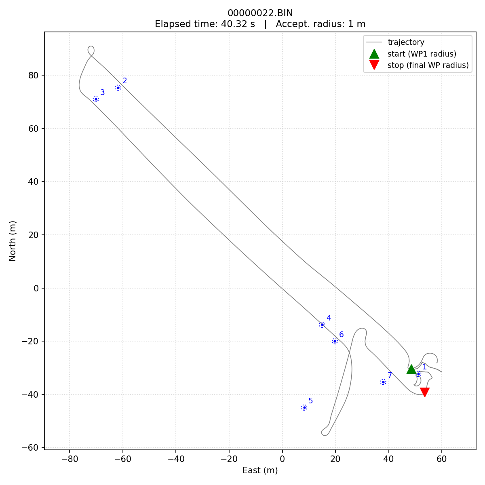
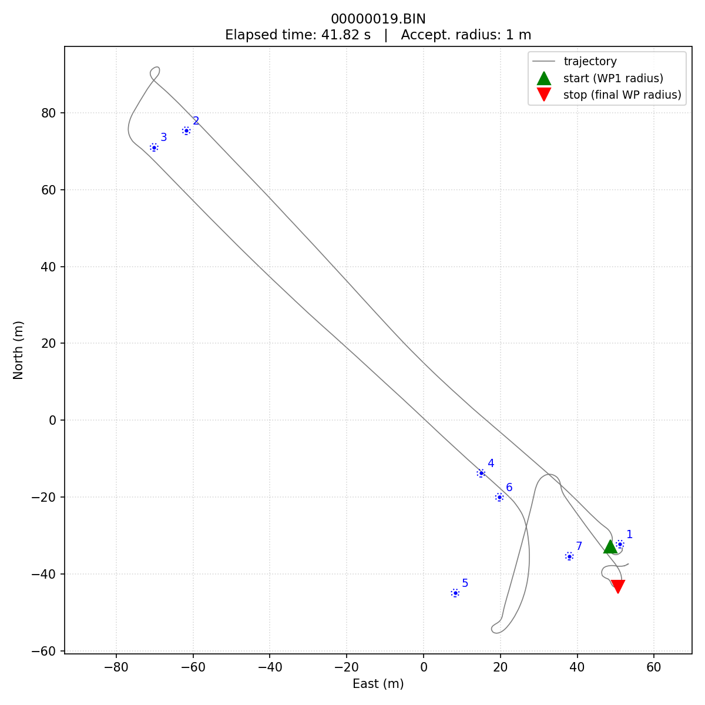
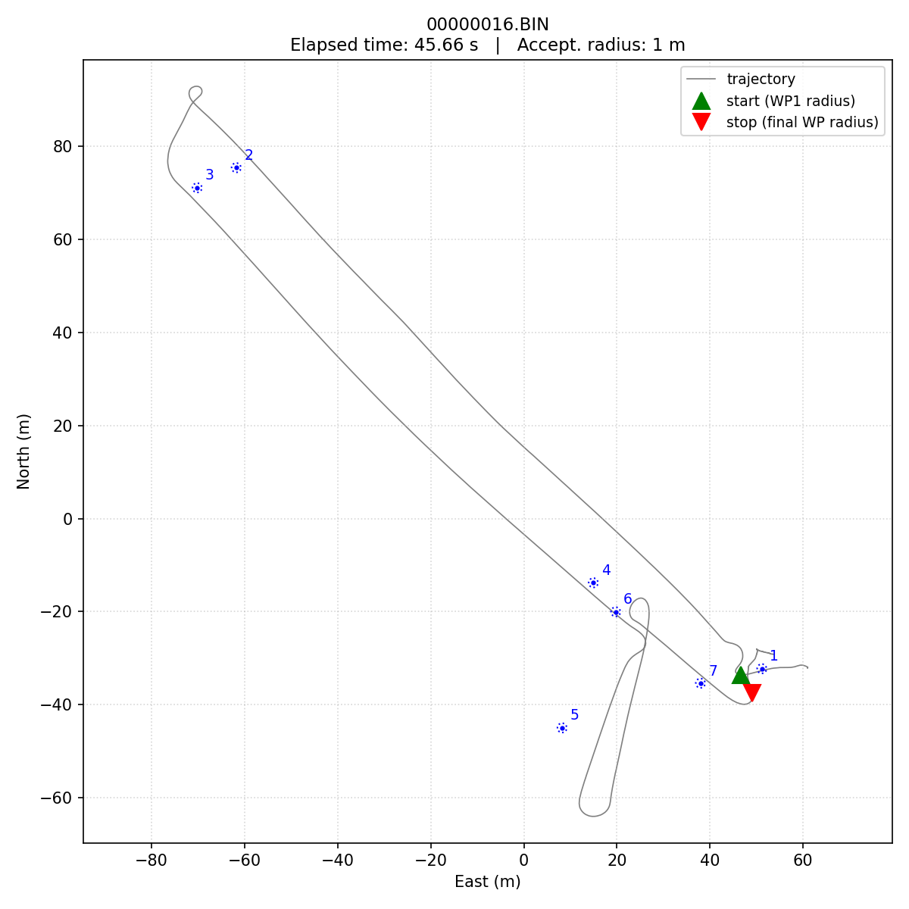
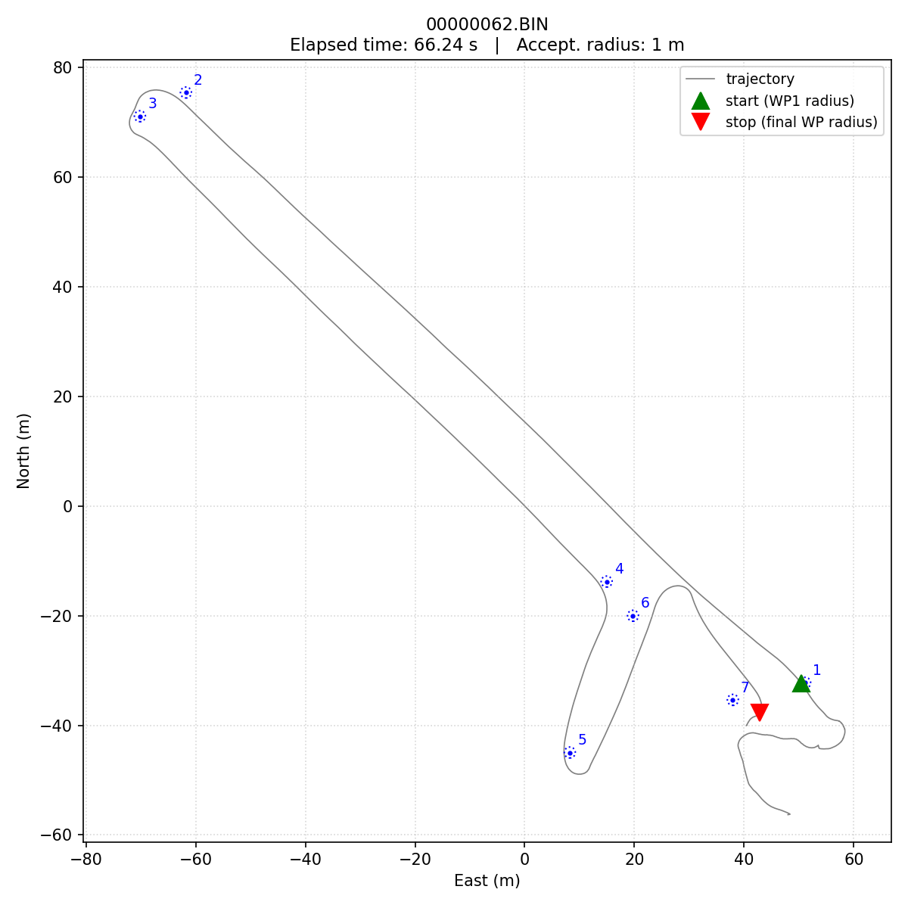
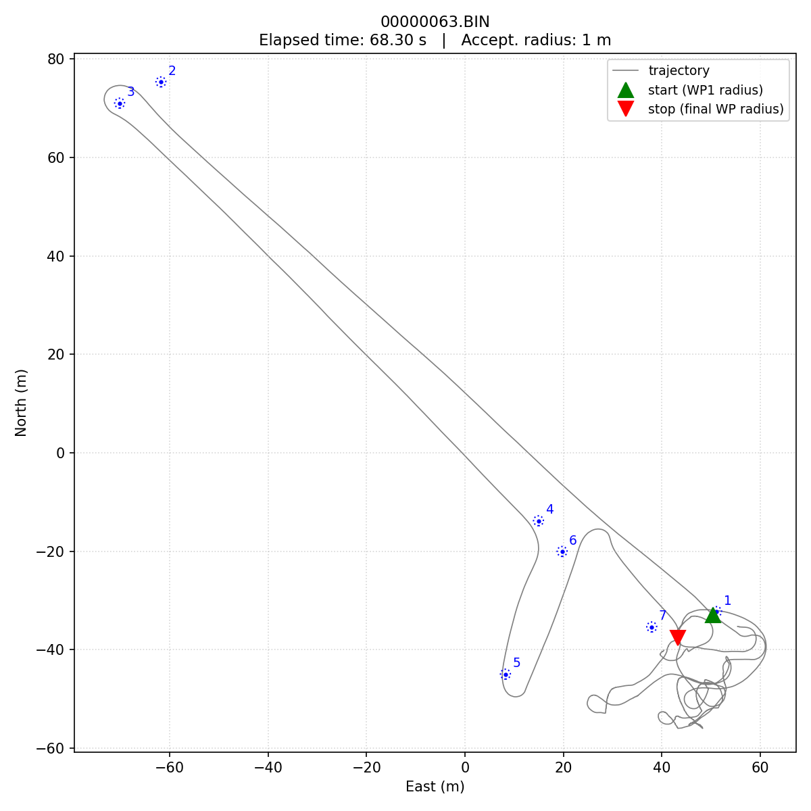
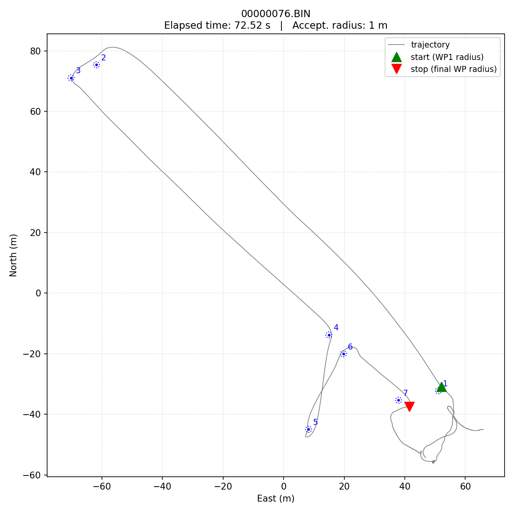
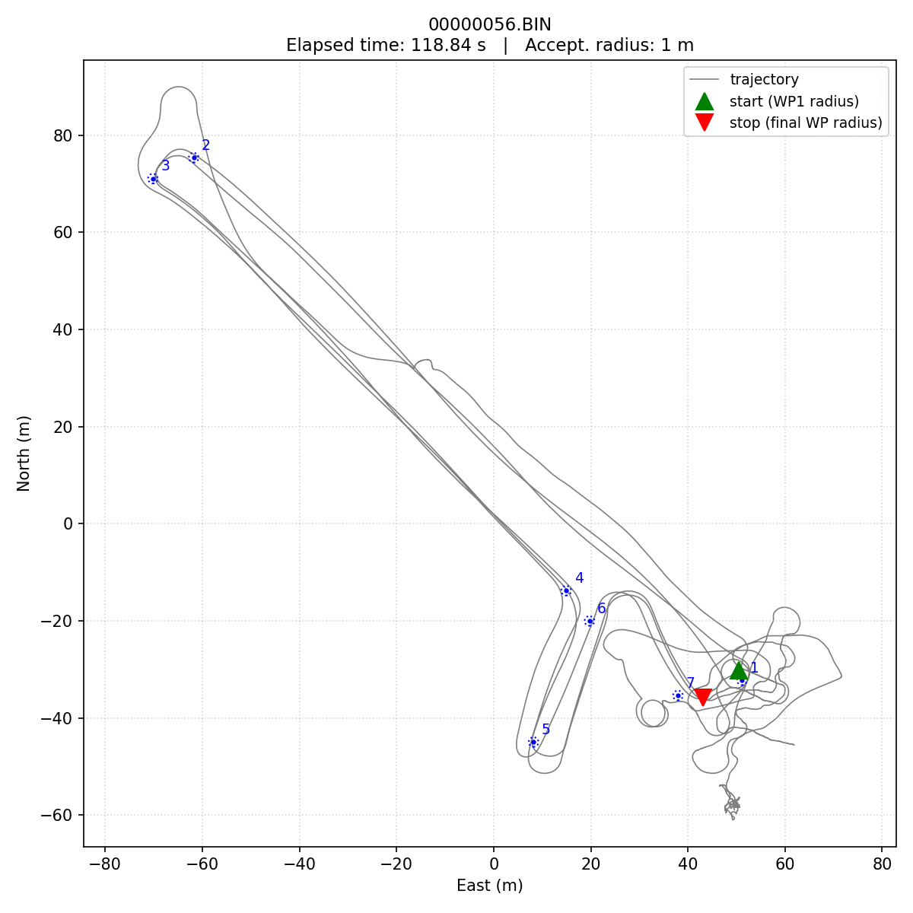

[← Back to Lab 3 overview](index.qmd)

## Highlight videos

- [Day 1 — time lapse of the day](https://youtu.be/_MJer6qtC7E)

More to come.

## Final standings

Best course time per team after Day 2. Times are the autopilot's own
WP1-to-WP7 elapsed, as logged in the `MSG` "Reached waypoint #N" events
— see [Scoring notes](#scoring-notes) below.

| Rank | Team | Best time | UTC time of run | Log |
|:---:|---|---:|:---:|:---:|
| 1 | team3      | 00:40 (40.3 s)  | 2026-06-04 19:08:31 | `00000022.BIN` |
| 2 | cyborgs    | 01:06 (66.2 s)  | 2026-06-04 18:15:36 | `00000062.BIN` |
| 3 | blackpearl | 01:59 (118.8 s) | 2026-06-04 18:29:46 | `00000056.BIN` |
|  | *Instructor benchmark* | *03:13 (193.4 s)* | *2026-05-29 (prototype day)* | — |

Headline: every team improved on Day 2, and team3 made the largest
jump — from 103.4 s on Day 1 to 40.3 s on Day 2 (~60% faster), enough
to overtake cyborgs and take the win.

## Day-over-day improvement

| Team | Day 1 best | Day 2 best | Δ |
|---|---:|---:|---:|
| team3      | 103.4 s | 40.3 s  | −63.1 s |
| cyborgs    | 75.2 s  | 66.2 s  | −9.0 s  |
| blackpearl | 205.8 s | 118.8 s | −87.0 s |

## Per-team breakdown

Parameter-change summaries are general descriptions, not exact details. The point is to convey what each team tuned, not to give away their recipe.

---

### team3 — 1st, 40.3 s

**Day 2 top 3:**

| # | Time | UTC | Log |
|:-:|---:|:--|:--|
| 1 | 00:40 (40.3 s) | 2026-06-04 19:08:31 | `00000022.BIN` |
| 2 | 00:42 (41.8 s) | 2026-06-04 19:05:47 | `00000019.BIN` |
| 3 | 00:46 (45.7 s) | 2026-06-04 19:00:26 | `00000016.BIN` |

{width=80% fig-alt="Trajectory plot of team3's best Day-2 run, showing the boat traversing all 7 waypoints with the start (green) at WP1 and stop (red) at WP7."}

{width=80% fig-alt="Trajectory plot of team3's second Day-2 run."}

{width=80% fig-alt="Trajectory plot of team3's third Day-2 run."}

**Day 2 strategy.** team3 came back to the field having learned the lesson from Day 1's extreme settings — that asking for 40 m/s when the boat tops out at ~3 m/s buys you nothing. Their Day-2 logs show an iterative speed escalation: 8, 11, 14, 15, 15.5, 16 m/s, dialing in the highest target the boat could actually follow. They also bumped the turn radius up from ~1 m to 5 m, letting the autopilot cut wide arcs through the corners instead of trying to pivot tight; cut the throttle baseline bias from max to half; reduced the steering derivative gain; and tested very-small acceptance radii (0.1 m) before going back to 1 m. Net: same aggressive-and-repeatable temperament as Day 1, but pointed at targets the plant could actually deliver. Result: six complete runs on Day 2 with a clear improvement arc (58 → 60 → 51 → 46 → 42 → 40 s).

**Day 1 results** (for reference): four runs clustered 103-108 s, best 103.4 s.

---

### cyborgs — 2nd, 66.2 s

**Day 2 top 3:**

| # | Time | UTC | Log |
|:-:|---:|:--|:--|
| 1 | 01:06 (66.2 s) | 2026-06-04 18:15:36 | `00000062.BIN` |
| 2 | 01:08 (68.3 s) | 2026-06-04 18:21:43 | `00000063.BIN` |
| 3 | 01:13 (72.5 s) | 2026-06-04 18:55:50 | `00000076.BIN` |

{width=80% fig-alt="Trajectory plot of cyborgs' best Day-2 run."}

{width=80% fig-alt="Trajectory plot of cyborgs' second Day-2 run."}

{width=80% fig-alt="Trajectory plot of cyborgs' third Day-2 run."}

**Day 2 strategy.** cyborgs came in with the strongest Day-1 baseline and chose to refine rather than rebuild. Their Day-2 logs show only modest tuning changes: cruise/waypoint speed bumped from 10 to 15 m/s, some experimentation with the speed-axis acceleration limit. The first two Day-2 runs (BINs 62 and 63) were their fastest of the whole challenge — they got most of their improvement in the first hour. The remaining Day-2 runs sat slightly slower but still under 90 s. A controlled, low-variance approach that hit a local optimum quickly.

**Day 1 results** (for reference): seven runs, clear iteration arc 195 → 88 → 75, best 75.2 s.

---

### blackpearl — 3rd, 118.8 s

**Day 2 top 3 (only one successful run):**

| # | Time | UTC | Log |
|:-:|---:|:--|:--|
| 1 | 01:59 (118.8 s) | 2026-06-04 18:29:46 | `00000056.BIN` |

{width=80% fig-alt="Trajectory plot of blackpearl's only successful Day-2 run."}

**Day 2 strategy.** blackpearl ran the broadest parameter search of any team. Their Day-2 logs show five different `WP_SPEED` settings tried (2, 3, 3.5, 8, 14 m/s), multiple iterations on both speed-loop and steering-loop PIDs, a mid-session change to the mission file itself (`MIS_TOTAL` 8 → 11, suggesting they uploaded a different waypoint set), and a steady increase in `TURN_RADIUS` from ~1 to 3 m. The exploration was thorough; the conversion rate was low — only one of the ten Day-2 logs produced a complete-course run, and the boat had clearly settled on its high-speed configuration by then. Big improvement over Day 1 (205.8 s → 118.8 s) but the breadth-of-search approach didn't yield the tight iteration arcs that team3 and cyborgs produced.

**Day 1 results** (for reference): one complete run, 205.8 s.

---

## What the two days tell us

Three different strategies, three different outcomes. The team that came in furthest behind on Day 1 (team3) ended the challenge in 1st place, having recognized that their Day-1 setup was asking for things the boat couldn't deliver and rebuilt around realistic targets. The team that led on Day 1 (cyborgs) defended well but didn't make a comparable leap. The team in the middle (blackpearl) used Day 2 to explore broadly rather than commit to a known-working baseline, and paid for it in low yield of finished runs.

The relationship between Lab 2 stabilization tuning and Lab 3 course time held throughout: every successful Day-2 run was made with target speeds the boat's surge dynamics could actually follow. The runs that didn't finish were almost always trying to ask the plant for something outside its envelope.

## Scoring notes

A complete-course run is one where the autopilot's `MSG` log contains
`"Reached waypoint #N"` for N = 1 .. 7 in that order — the autopilot's
own mission-advancement signal, which uses both a radius check *and* a
perpendicular-crossing check. The second of those means a boat moving
at speed can clear the mission without ever physically entering
`WP_RADIUS`, and a scoring script that only checks radius entry will
undercount finishes. This is exactly what happened to team3's Day-1
results before the scoring script was fixed.

The full discussion (both arrival conditions, why the radius check is
not a "how close did I pass" tolerance, links to the ArduRover docs
and the relevant GH issue) lives in the autopilot reference:
[Waypoint Navigation → When is a waypoint "reached"?](../../autopilot/waypoint_navigation.qmd#when-is-a-waypoint-reached).

## Notes

- Per-team strategy summaries are drawn from the evolution of PARM values across each team's Day-2 logs (parameters that took on more than one distinct value, with sensor calibration and boot-statistics noise filtered out). Underlying logs are in `/data/ME2801_USV/2026_06_03_challengeday1/logs/` (Day 1) and `/data/ME2801_USV/challengeday2/logs/` (Day 2), instructor-only access.
- Trajectory PNG files for every successful run are saved alongside their `.BIN` log in the data directories.
- The instructor benchmark (193.4 s on the prototype day) is preserved as a comparison row but is not part of the team standings.
