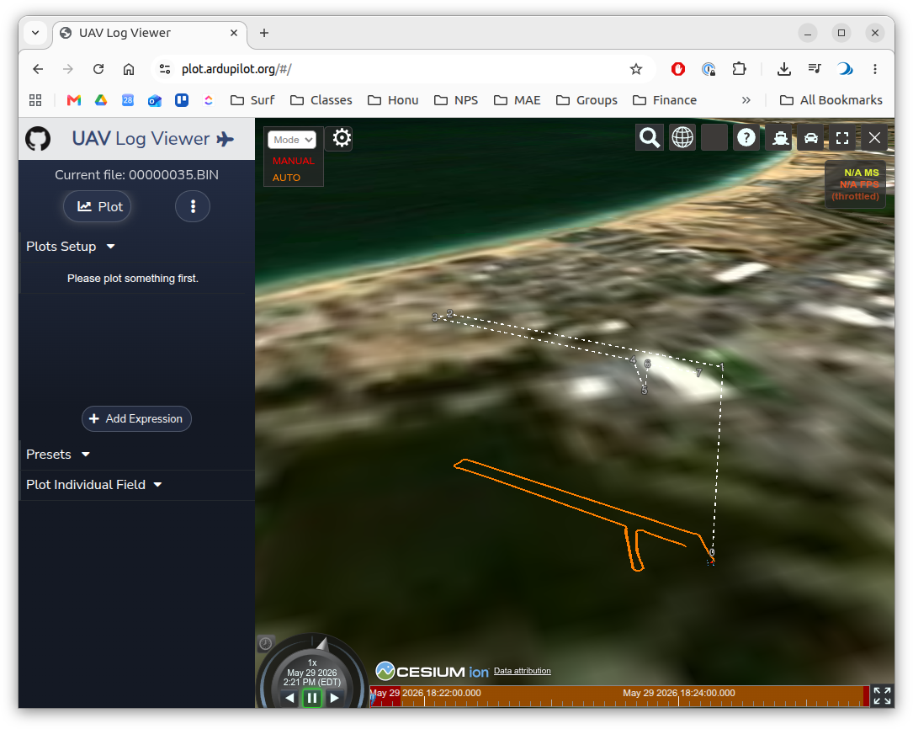

[← Back to Lab 3 overview](index.qmd)

<!-- TODO (bsb): write a general-purpose field QA/QC note (probably under
     site/autopilot/) covering how to confirm log integrity, signal coverage,
     and parameter capture *at the field* before tearing down. Link to it
     from this page's "At the field — quality check" step once it exists. -->

## Lessons learned

* **Mode Awareness**: It's easy to forget which mode you're in, especially when you're switching back. You must be in **AUTO** mode for the autopilot to execute the uploaded waypoint mission; MANUAL is direct pilot control and ACRO is what you used in Lab 2 for the closed-loop step tests.
* **Write Params**: When changing the autopilot parameters, make sure to click "Write Params" in Mission Planner to save them to the autopilot.  If you forget this step, the parameters will not be updated on the autopilot and you won't see the expected changes in behavior.
* **Compass Calibration**: Insufficient compass calibration can prevent ARM'ing the USV.  This can also lead to other, more subtle issues.  The instructors have not been able to reproduce this behavior.   Make sure the vessel is flat and level when powering up the autopilot and when doing the large vehicle calibration.   Worst case, try doing a "full" calibration through Mission Planner.  Make sure to secure the USV internals so that you can rotate it in all orientations without damaging anything.
* **QA/QC Data in the Field**:  Before putting the USV away, do some quick visualization of a selection of the log files to take a high-level peek at contents of the logs.  Use this online tool (\url{https://plot.ardupilot.org/}) to peek at the raw BIN files from the SD card.  This can help you confirm that the logs are capturing the signals you expect, and that the signals look reasonable (e.g. not all zeros, not saturated at max value, etc.).  

## Configuration Parameter Changes

There are a few parameter changes we discovered in prototyping the lab:

% CLAUDE: For each of these, provide a link to the relevant ArduRover documentation for that parameter.   
* **`AUTO_KICKSTART = 0`**: By setting this to zero, as soon as the pilot switches to AUTO, the USV will immediately execute the mission. 
* **`WP_RADIUS = 1`**:  Sets the acceptance radius for each waypoint to 1 meter.  For the competition to be fair, all teams should use the same acceptance radius.  
* **`FS_ACTION = 0`**: This disables the failsafe behavior of the autopilot.  If the autopilot detects a failure condition (e.g. loss of R/C signal, loss of GPS, low battery, etc.) it will continue the mission.   The USV will likely loose connection to the R/C transmitter at the far side of the lake.  This triggers a failsafe and if this value is non-zero, the USV will stop executing the mission and stop.  

The full parameter file from the instructors' baseline is here: [`docs/2026_05_29_proto.param`](docs/2026_05_29_proto.param).  We would recommend searching through this if you have questions, but using this full file will overwrite your stabilization-layer tuning from Lab 2, so we recommend just changing the parameters above for the baseline runs and then using this file as a reference for any other parameter changes you want to make.

## 1. Pre-lab

- Confirm all hardware: boat, batteries (vehicle + autopilot + R/C + ground laptop), 900 MHz radio, R/C transmitter.
- Mission file loaded on the ground laptop. Lab-2 baseline `.param` on hand.
- Roles assigned (Planner / Scribe / Pilot).
- Scribe template ready (UTC time + intent per arm).

## 2. Shore setup

- Standard ArduRover bring-up (see [Lab 2 Procedure §2](../w07_lab_usv_pid/procedure.qmd) for the detailed checklist — same vehicle, same telemetry, same baseline confirmation).
- Upload the mission file to the autopilot via Mission Planner.
- Confirm waypoints render correctly on the Mission Planner map.

## 3. Running the course

Vehicle Safety Notes:

* Pilot can abort a mission when in R/C range by switching to MANUAL or ACRO mode.
* Planner can command the USV to return to launch (RTL) at any time, which will cause the USV to return home.   This is particularly useful if the USV goes out of R/C range!

Typical Process: 

- Pilot ARMs,starts new log file
- Scripe notes the UTC arm time to correlate with log file later.
- Pilot is in MANUAL (or AUTO) and drives to a safe starting point.
- Run mission:
     - Pilot switches to AUTO to start the mission. 
     - Planner confirms AUTO on Mission Planner.
     - Scribe starts the stopwatch when the USV is within the acceptance radius of first.
     - Pilot and Planner monitor the mission execution, ready to abort (switch out of AUTO model).
     - (Optional)  Good idea to take screen grab of the Mission Planner display during the run, to capture the course time and the trajectory for later comparison to the log-derived results.
     - Scribe stops the stopwatch when the USV is  within the acceptance radius of the final waypoint.
- Pilot switches to MANUAL after the mission completes. 
- Pilot Dis-ARM to close the log - and re-ARM.
- Scribe notes the UTC time as the end of the log file. 
- Planner saves the current parameter file locally.

## 4. Log recovery

Remove the SD card from the autopilot and copy the `.BIN` log file to the shared repository, in your team's subfolder.  

* [ME2801_USV_Shared](https://nps01-my.sharepoint.com/:f:/g/personal/bbingham_nps_edu/IgBrVQgpC7VsQ4pnhatXVfWBAatl-so1kOaAatxqty9Bj7g?e=C0EGzJ) — upload raw `*.BIN` mission logs to your team subfolder.

## 4. At the field — data quality check

It is highly recommended to do a quick check of the log files in the field. The \url{https://plot.ardupilot.org/} tool is great for a quick peek at the raw BIN files from the SD card.

## 5. Post-field

- Upload `.BIN` logs to the shared repository, in your team's subfolder.
- Run the analysis script *(TBD)* to generate the trajectory plot and the log-derived course time.
- Assemble the deliverable slide.
